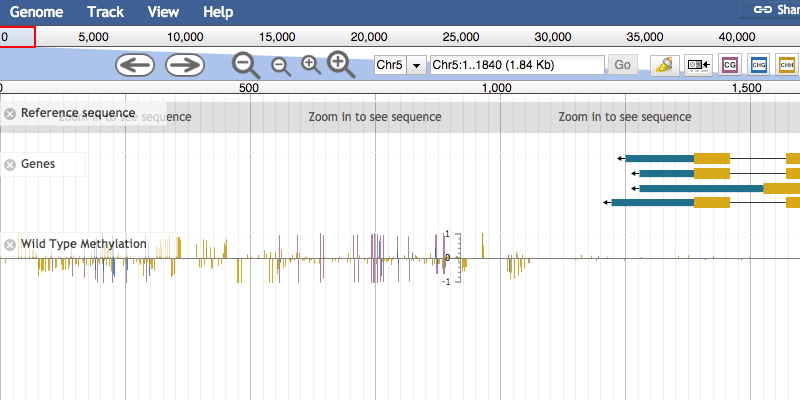

[](https://travis-ci.org/bhofmei/jbplugin-methylation)

# Methylation Plugin
This is a JBrowse plugin
 
This plugin is to be used with whole-genome bisulfite sequencing (WGBS) data, tet-assisted bisulfite sequencing (TAB-seq) and/or SMRT to detect base modifications. Unlike almost all other browsers, this plugin allows you to see all methylation contexts on one track.

This plugin is color-blind friendly!

### JBrowse compatibility
- Originally designed for JBrowse v1.12.x (which uses bower install)
- Currently continuous integration and unit tests are run again JBrowse v1.12.6
- JBrowse v1.13 introduced a new way to install/package JBrowse
- Starting with JBrowse v1.13, the development version must be used
- Has been manually tested for JBrowse v1.14.2-dev
  - due to node/jbrowse incompatiblities issues, I was unable to with JBrowse v1.13.0 to v1.14.1
  - likely works with these versions though

## Install

For JBrowse v1.11.6+ in the _JBrowse/plugins_ folder, type:  
``git clone https://github.com/bhofmei/jbplugin-methylation.git MethylationPlugin``

**or**

downloaded the latest release version at [releases](https://github.com/bhofmei/jbplugin-methylation/releases).  
Unzip the downloaded folder, place in _JBrowse/plugins_, and rename the folder _MethylationPlugin_

## Activate
**Note:** For JBrowse v1.13+, you MUST use JBrowse v1.x.x-dev and run `setup.sh` after activating the plugin.
### Web-browser
Add this to _jbrowse.conf_ under `[GENERAL]`:

    [ plugins.MethylationPlugin ]
    location = plugins/MethylationPlugin

If that doesn't work, add this to _jbrowse\_conf.json_:

    "plugins" : {
        "MethylationPlugin" : { "location" : "plugins/MethylationPlugin" }
    }
    
**DO NOT ADD THE PLUGIN TO BOTH!**
    
**NOTE**: The plugin location folder can be named differently, i.e. _jbplugin-methylation_, but the plugin ID MUST be `MethylationPlugin` for the plugin to work correctly.

### Desktop-version
The plugin location folder **MUST** be named _MethylationPlugin_. When specifying location, you must use the **absolute** path to the plugin directory.

To pre-load the plugin for a dataset, add to _tracks.conf_ for the dataset then open the data directory.
```
[plugins.MethylationPlug]
location = full-path-to-plugin/MethylationPlugin
```

Or pre-load the plugin in _trackList.json_
```
"plugins" : {
  "MethylationPlugin" : {
    "location" : "full-path-to-plugin/MethylationPlugin" 
  }
}
```

You can also load the plugin after opening a data directory using the "Genome" -> "Open plugin" from the menu bar.

## Test
Sample data is included in the plugin to test that the plugin is working properly. With `URL` as the URL path to the JBrowse instance, navigate a web browser to `URL/index.html?data=plugins/MethylationPlugin/test/data`.



## Plugin Configuration Options

Plugin defaults are designed for WGBS (5mC) of plant data.

Additional plugin configurations support 
1. animal-vs-plant sequence context color schemes
2. Extended base modifications 4mC and 6mA from SMRT

### Animal-specific coloring
While the plant world likes methylation broken into CG, CHG, and CHH, the animal world prefers CG and CH. For those only interested in CG, ignore this and be sure to specify only the CG context in the configuration (see track configuration options below).

The default (and suggested) colors are:
- CG: dark pink
- CHG: blue
- CHH: gold
- CH: green

Using the animal coloring scheme is enforced hierarchically. Configurations specified at a higher level overpower lower-level specification. If not specified at a specific level, inherits the setting of the level below. 

| level| location | general config syntax | plugin config syntax|
|--|--|--|
|*highest* | individual track config | `isAnimal=true` | | 
| | _tracks.conf_ | `[general]`<br>`isAnimal=true` | `[plugins.MethylationPlugin`<br>`isAnimal=true`|
| | _jbrowse.conf_ | `[general]` <br> `isAnimal=true` | `[plugins.MethylationPlugin`<br>`isAnimal=true` |
|*lowest*| **default** | `isAnimal=false`| |

Note that toolbar buttons are defined by _tracks.conf_ and _jbrowse.conf_.

These can also be set in _trackList.json_ and _jbrowse\_conf.json_ using JSON sytanx.
Specify in _tracks.conf_ OR _trackList.json_, **NOT BOTH**. Specifiy in _jbrowse.conf_ OR _jbrowse\_conf.json_, **NOT BOTH**.

If plugin is activated in _jbrowse.conf_, do not set configuration in _jbrowse\_conf.json_ and visa-versa. Similarly with _tracks.conf_ and _trackList.json_.

### Extended base modifications
SMRT is able to detect m4C and m6A at single base resolution. Additionally, TAB-seq can detect 5hmC.
However both are expensive and uncommon, so visualization 4mC, 5hmC, and/or 6mA is turned off by default.

When used, these contexts are additional colored
- 4mC: teal/cyan
- 5hmC: dark red
- 6mA: purple

To turn on support for all species, change the plugin configuration in _jbrowse.conf_ or _jbrowse\_conf.json_ (but not both).

In _jbrowse.conf_, 
```
[plugins.MethylationPlugin]
...
extendedModifications = true
```

To turn on/off support for a single species/dataset, change the plugin configuration in _tracks.conf_ or _trackList.json_ (but not both).

In _tracks.conf_,
```
[plugins.MethylationPlugin]
extendedModifications = true
```

## Using Methylation Tracks

**This documentation is for version 3.** Versions 1 and 2 are still supported, but not recommended for use. For information about using version 1 and/or 2, see [Previous Versions](Previous-versions.md)
- There will be a BigWig file for each context of interest
  - Default contexts: ["CG", "CHG" "CHH"]
  - Also supported: ["4mC", "5hmC", "6mA"]
  - Animal coloring uses CG and CH. CH context will have two BigWigs (one for CHG and one for CHH)
- Includes support to be able to filter use all or only methylated sites within one track. This keeps the global view looking good when zoomed out but allows for better visualization when zoomed in.

### File Conversion
Use the conversion program appropriate to your input file type. 
_bedGraphToBigWig_ and _bedSort_ (programs from UCSC) must be on your path. See [details below](Getting-bedGraphToBigWig-and-bedSort) for acquiring these programs.

#### allC Files
- allC files have these columns: chr, pos, strand, mc_class, mc_count, total, is_methylated
- Methylated/unmethylated positions are denoted by the value.
- All chromosomes need to be combined into one allC file.
- You also need a file with chromosome sizes. This file should be tab-delimitated, one chromosome per line, with at least chromosome name and chromosome size. The genome's FASTA index (.fa.fai) file works well.
- For a given genome (i.e. chromosome sizes), you can specify an unlimited number of allC files to be converted.

```
Usage:  python3 allc_to_bigwig_pe_v3.py [-keep] [-sort] [-L=labels] [-o=out_id]
        [-c=base_mod] [-p=num_proc] <chrm_sizes>  <allC_file> [allC_file]*

Required:
chrm_file     tab-delimited file with chromosome names and lengths,
              i.e. fasta index file
allc_file     allc file with all chrms and contexts

Optional:
-keep         keep intermediate files
-sort         calls bedSort; add this option if bigwig conversion fails
-L=labels     comma-separated list of labels to use for the allC files;
              [default uses information from the allc file name]
-o=out_id     optional identifier to be added to the output file names [default none]
-c=base_mod   base modification for file extension; single modification for
              Call input files, i.e. 5hmC; overrides default G,CHG,CHH output
-p=num_proc   number of processors to use [default 1]
```

##### For 5mC
- Run `allc_to_bigwig_v3.py` as normal **without** specifying `-c=base_mod`
- For each input allC files _allc\_input.tsv_, with default parameters, this will create three output files: _input.bw.cg_, _input.bw.chg_, and _input.bw.chh_.

##### For 5hmC
- Run `allc_to_bigwig_v3.py` as normal **specifying** `-c=5hmc`
- For each input allC file _allc\_input.tsv, this will create one output file: _input.bw.5hmc_

#### Bismark
- Bismark files have the following columns: chr, pos, strand, methylated reads, total reads, C context, trinucleotide context
- When filtering for methylated sites only, any site with at least 1 methylated read is considered "methylated"

```
Usage:  python3 bismark_to_bigwig_pe_v3.py [-keep] [-sort] [-L=labels] [-o=out_id]
        [-p=num_proc] <chrm_sizes>  <bismark_file> [bismark_file]*
Required:
chrm_file     tab-delimited file with chromosome names and lengths,
              i.e. fasta index file
allc_file     bismark file with all chrms and contexts

Optional:
-keep         keep intermediate files
-sort         calls bedSort; add this option if bigwig conversion fails
-L=labels     comma-separated list of labels to use for the allC files;
              [default uses information from the allc file name]
-o=out_id     optional identifier to be added to the output file names [default none]
-p=num_proc   number of processors to use [default 1]
```

For each input allC files _input.tsv_, with default parameters, this will create three output files: _input.bw.cg_, _input.bw.chg_, and _input.bw.chh_.

To run Bismark files for 5hmC, contact me.

#### 4mC and 6mA GFF Files
- These GFF files have the following columns: chr, source, feature type, start, end, score, strand, frame, attributes
  - Feature must be "m4C"/"4mC" or "m6A"/"6mA" to be included in output (one file for each)
  - In the attributes, the "frac" attribute determines methylation level, i.e. height of bar.
- All features are considered "methylated". If this needs changed, contact [Brigitte](bhofmei@gmail.com)
- **Note**: When overlaying with allC/bismark C data, the output file names must be the same except for the extension. Use `-o=out_id` for corresponding m5C files "out\_id\_v3.bw.*"

```
Usage:  python3 gff_to_bigwig_pe_v3.py [-q] [-h] [-keep] [-sort] [-o=out_ids]
        [-p=num_proc] [-s=gff_search_term] <chrm_sizes> <gff_fille> [gff_file]*

Required:
chrm_file       tab-delimited file with chromosome names and lengths,
                i.e. fasta index file
gff_file        gff file with 4mC and/or 6mA positions on all chrms

Optional:
-keep           keep intermediate files
-sort           calls bedSort; add this option if bigwig conversion fails
-s=gff_search   GFF attribute which has methylation level
                [default "frac"]
-o=out_id       optional ID for output files [default from input file name]
                if one ID specified, applied to all input GFFs
                comma-separated list IDs for multiple GFFs
-p=num_proc     number of processors to use [default 1]
```

For each GFF _input.gff_ which contains both m4C and m6A, with default paramters, this will create _input.bw.4mc_ and _input.bw.6ma_.

### JSON Track Specifications
Track specifications are very similar to those for XYPlots (see JBrowse tutorial for more information). The _label_, _type_, and _urlTemplate_ must be specified. 

_urlTemplate_ is the path and filename up-to, but not including, the context-specific extension.

For example, for files _path/my-file.bw.cg_, _path/my-file.bw.chg_, and _path/my-file.bw.chh_, use `"urlTemplate" : "path/my-file.bw"`.

In _trackList.json_,
```
{  
  "key" : "Wild Type Methylation",
  "label" : "track_wild_type_methylation",
  "storeClass" : "MethylationPlugin/Store/SeqFeature/MethylBigWig",
  "urlTemplate" : "path/my-file.bw",
  "type" : "MethylationPlugin/View/Track/Wiggle/MethylPlot",
  "methylatedOption" : true
}
```

#### Subset of contexts
By default, the plugin will search for CG, CHG, and CHH contexts. If there is not a file for each context, specify only the contexts needed.
```
 "contexts" : ["cg", "chh"]
```

#### Extended modifications (4mC, 5hmC, and 6mA)

4mC, 5hmC, and 6mA must be specified to be used. When used with 5mC (CG, CHG, CHH) methylation, all contexts must be specified and BigWig files for all extensions must exist.
```
 "contexts" : ["cg", "chg", "chh", "4mc", "5hmc", "6ma"]
```

Not all contexts need to be included. If only interested in 5mC and 5hmC, use ``"contexts" : ["cg", "chg", "chh", "5hmc"]```
#### Animal-vs-Plant coloring
To force animal sequence context coloring (CG and CH) for a track when plugin/species is not animal,
```
"isAnimal" : true
```

To force non-animal/plant sequence coloring (CG, CHG, CHH) for a track when plugin/species is animal,
```
"isAnimal" : false
```

See [Animal-specific coloring](#Animal-specific-coloring) for more details.

### HTML-style Tracks
- Using the HTML-style track is not recommended because it can be slow for large regions and/or lots of data.
- However, HTML-style tracks are preferred when taking screenshots. 
  - The default methyl track type paints the basepair methylation (feature) on a HTML `canvas` element.
  - That's great for speed but is exported as an uneditable image.
  - In the HTML-style tracks,  each base (feature) is exported as an editable HTML `div` element
-  It is recommended you _only_ use HTML-style tracks when taking screenshots. 
See this [JBrowse plugin](https://github.com/bhofmei/jbplugin-screenshot.git) which makes taking screenshots easy and is configured to work with this methylation plugin.
- **Note**: The HTML-style track does allow for hiding/showing context and "methylated positions only" but does not support min and max score changes (default min: -1, max: 1).
- To use an HTML style track, all configuration options are the same as above except "maxHeight" (vs "style.height") to set the track height and "type".

```
{
  "type" : "MethylationPlugin/View/Track/MethylHTMLPlot",
  "maxHeight": 100,
}
```

## Additional Features

1. Turn on/off a sequence context for a specific track using the track's dropdown menu.

2. Turn on/off sequence contexts for **all visible tracks**

  A. Without extended modifications, use sequence specific buttons in the toolbar
  
  B. With extended modifications, use the methylation filter button in the toolbar to open a dialog

## Getting bedGraphToBigWig and bedSort
### Option 1: Download manually
Mac OSX 64-bit: <http://hgdownload.cse.ucsc.edu/admin/exe/macOSX.x86_64/>  
Linux 64-bit: <http://hgdownload.cse.ucsc.edu/admin/exe/linux.x86_64/>  
Older Linux/Linux server: http://hgdownload.cse.ucsc.edu/admin/exe/linux.x86_64.v287/

- Choose the appropriate web page from above. There will be a long list of programs. 
- Scroll down to find __bedGraphToBigWig__ and __bedSort__
- Save this program to computer
- In terminal, navigate to the directory with the program
- Type `chmod u+x bedGraphToBigWig bedSort`
- Move the program to the same directory as __allc_to_bigwig_pe.py__ or add to path in __.bashrc__ or __.bash_profile__

### Option 2: Create symbolic links
Versions of __bedGraphToBigWig__ and __bedSort__ are included in the _bin_ directory.

Based on the operating system, create symbolic links in the _bin_ directory

- MacOSX 64-bit: `ln -s bedGraphToBigWig_macOSX.x86_63 bedGraphToBigWig; ln -s bedSort_macOSX.x86_64 bedSort`
- Linux 64-bit: `ln -s bedGraphToBigWig_linux.x86_64 bedGraphToBigWig; ln -s bedSort_linux.x86_64 bedSort`
- Older Linux: `ln -s bedGraphToBigWig_linux.x86_64.v287 bedGraphToBigWig; ln -s bedSort_linux.x86_64.v287 bedSort`

For best results, add this directory to `PATH` in __.bashrc__ or __.bash_profile__.
